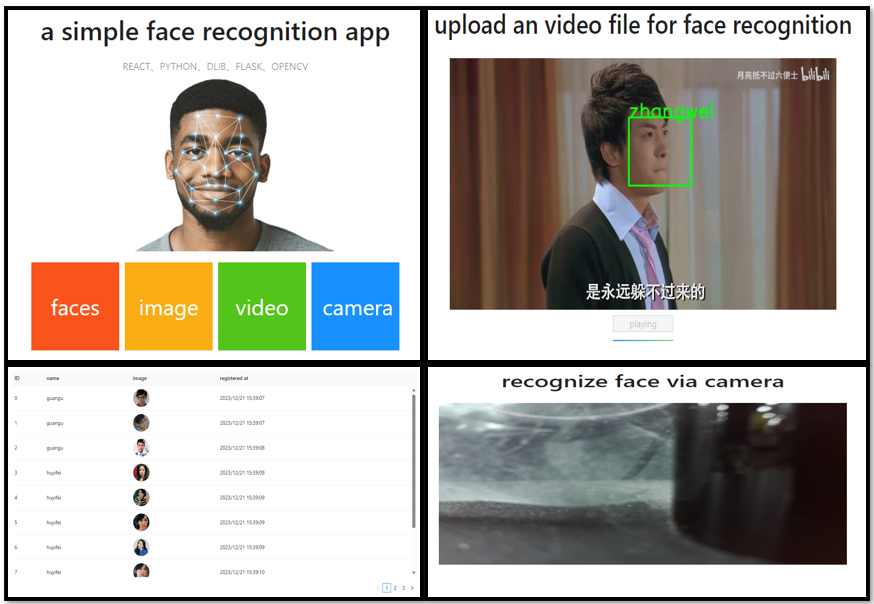
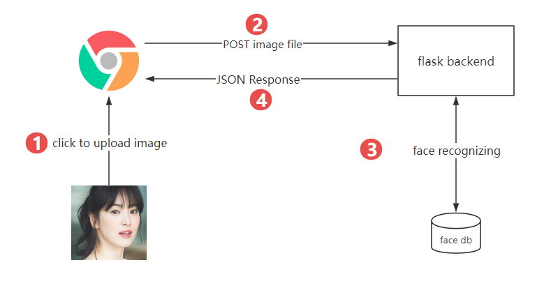
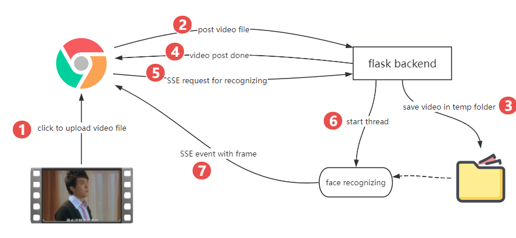
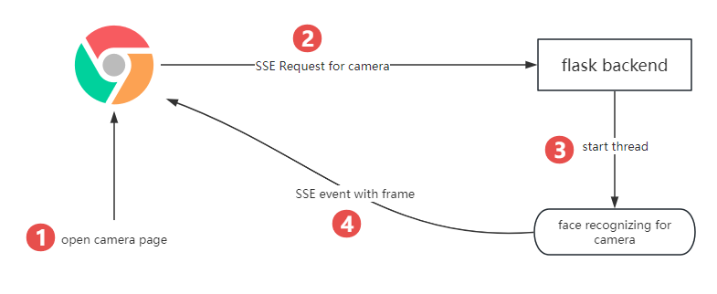

## install and run
### 1.frontend
1. yarn
2. yarn start
3. web listen on **:8000** port
### 2.backend
1. pip install -r requirements.txt
2. python app.py
3. flask backend listen on **:5000** port
### 3.create face db
not support register face from web yet, so plz follow the database creating steps:
1. put face images in ```backend/images/[name]``` folder
2. run **python gendb.py** command to create face database
3. a pickle db file **reps.pkl** would be created after the cmd
4. now you can test face recognizing funcs from web page
## SSE event
only for video and camera func
```json
{
  "type": "error" || "data",
  "image": "data:image/jpeg;base64,...",
  "extra": {
    "faces": [
      {
        "name": "name" || "unknown",
        "crop": "data:image/jpeg;base64,..." || null,
      },
    ]
  }
}
```
## core flow
### image

### video

### camera

## todo
app is still under developing
1. register face from web
2. real-time optimizing
3. list event on page
